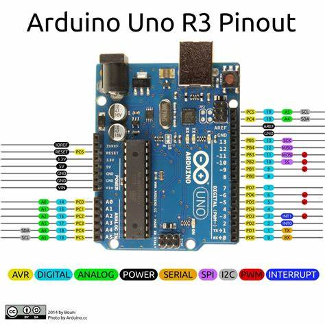

# Arduino UNO Blink project with PlatformIO VSCode extension

This is the tipical Hello World for Arduino framework.
Made to check that my developer setup is correctly configured.
This is a template project for future projects with PlatformIO VSCode extension for Arduino UNO board.

**Arduino UNO pinout**

## Samsung computer

- [x] Test upload firmware

## Chromebook

- [ ] Test upload firmware
