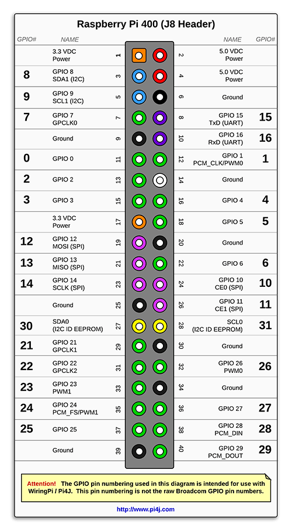

# Raspberry Pi 400 Blink project

This is the tipical Hello World for Raspberry Pi framework.
Made to check that my developer setup is correctly configured.
This is a template project for future projects with PlatformIO VSCode extension for Raspberry Pi 400 board.

**Raspberry pi 400 pinout**

